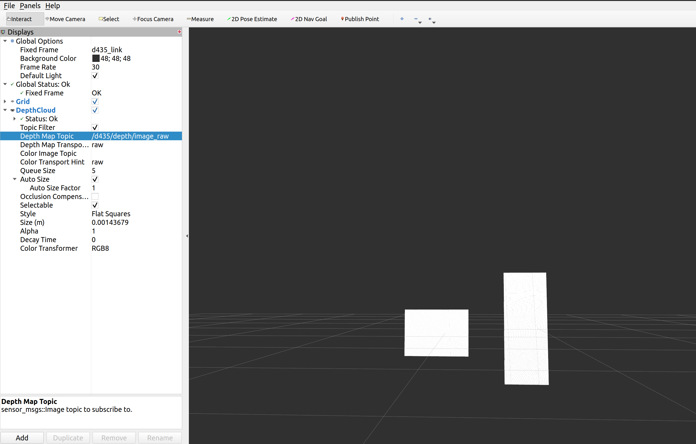
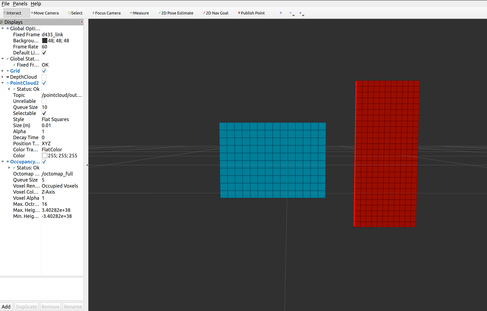

# publish_pointcloud
this code can be used for transfom the pointcloud into octomap
# 使用方法
## 下载到ROS工作空间

   cd catkin_ws/src

   git clone https://github.com/tjc609/pointcloud2Octomap.git

   cd ..

   catkin_make

   
## 启动转化节点
   
    roslaunch publish_pointcloud demo.launch

## PointCloud图像

## Octomap图像

